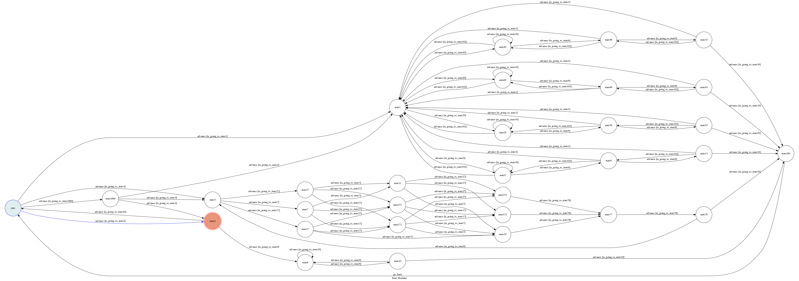

# chat_bot

Template Code for TOC Project 2017

A telegram bot based on a finite state machine

## Setup

### Prerequisite
* Python 3

### Install Dependency
```sh
sudo pip install -r requirements.txt
```

* if there are some problems, you should try the following step
* to solve problem about pygraphviz (For visualizing Finite State Machine)
    * [Setup pygraphviz on Ubuntu](http://www.jianshu.com/p/a3da7ecc5303)

### Secret Data

`API_TOKEN` and `WEBHOOK_URL` in app.py **MUST** be set to proper values.
Otherwise, you might not be able to run your code.

### Run Locally
You can either setup https server or using `ngrok` as a proxy.

**`ngrok` would be used in the following instruction**

```sh
./ngrok http 5000
```

After that, `ngrok` would generate a https URL.

You should set `WEBHOOK_URL` (in app.py) to `your-https-URL/hook`.

### Run the sever

```sh
python3 app.py
```

After that, you can chat on telegram bot, and get a Finite State Machine Figure

## Finite State Machine


## Usage

The initial state is set to `user`.

Every time `user` state is triggered to `advance` to another state, it will `go_back` to `user` state after the bot replies corresponding message.

### user

In my telegram bot, there are three topic, one is about `food`,  another is about `music`, and the other is about `chat`

* **food**:
  
  If you do not know what you want to eat, you can select this topic. 
  It will give you some suggest. If you agree with the suggest, you will get the menu of the restaurant. And then get some information about the restaurant.
	* breakfast
	* lunch
	* dinner
	* late-night supper

* **music**:
  If you do not know what you want to listen, you can select this topic. 
  It will give you some suggest. If you agree with the suggest, you will get the vedio about this suggest.
  
* **chat**:
  If you want to chat with my bot, you can select this topic. 

#### 1 step

* Input: "food"
	* **Reply: "what do you want to eat? breakfast, lunch , dinner or late-night supper"**

* Input: "music"
	* **Reply: "Do you want to listen to music ? yes(to get the music) or no(back to the initial state)"**

* Input: "chat"
	* **Reply: "你想要說些什麼？ hw , friend or other"**
    * Reply: "hw (計算理論作業的死線在後天喔，要記得交)"
    * Reply: "friend (你是不是有上計算理論阿？)"
    * Reply: "other (自由發揮)"

* Input: "hi" or "hello"
	* Reply: "hi"
	* **Reply: "what do you want to do? food , music or chat"**

#### 2 step about food(food)
* Input: "breakfast"
    * Reply: the picture about breakfast
    * **Reply: "Do you want to get more information about this breakfast? yes(to get the menu) , no(to get other breakfast) or back(back to the previous state) "**
    
* Input: "lunch"
    * Reply: the picture about lunch
    * **Reply: "Do you want to get more information about this lunch? yes(to get the menu) , no(to get other lunch) or back(back to the previous state) "**
    
* Input: "dinner"
    * Reply: the picture about dinner
    * **Reply: "Do you want to get more information about this dinner? yes(to get the menu) , no(to get other dinner) or back(back to the previous state) "**
    
* Input: "late-night supper"
    * Reply: the picture about late-night supper
    * **Reply: "Do you want to get more information about this late-night supper? yes(to get the menu) , no(to get other late-night supper) or back(back to the previous state) "**

the picture is random, there are `15 kinds of breakfast`, there are `10 kinds of lunch`, there are `10 kinds of dinner`,and there are `10 kinds of late-night supper`

#### 3 step about food(breakfast/lunch/dinner/late-night supper)
* Input: "yes"
    * Reply: "It's the menu"
    * Reply: the picture about the menu of food
    * **Reply:"Do you want to get more information about this  (breakfast/lunch/dinner/late-night supper)? yes(to get the information) , back(back to the previous state) or food(back to the food state)  "**
    
* Input: "no"
    * it will still at the same state and get other picture of food
    
* Input: "back"
    * it will go back to previous state

#### 4 step about food(menu)
* Input: "yes"
    * Reply: "It's the information"
    * Reply: the picture about the information of food
    * **Reply: "Do you want to turn to the food state? yes(back to the food state) , no(to go to the initial state) or back(back to the previous state) "**
    
* Input: "back"
     * it will go back to previous state and get other picture of food
    
* Input: "food"
    * it will go back to food state
    
#### 5 step about food(information)
* Input: "yes"
    * it will go back to food state
    
* Input: "no"
    * Reply: "It's finish"
    * Reply: "You can reselect food , music or chat"
    * it goes to user state
* Input: "back"
    * it will go back to previous state and get the menu

#### 2 step about music(music)
* Input: "yes"
    * Reply: "It's the information of music"
    * it will get the information about music
    * **Reply: "Do you want to listen to this music ? yes(to play music) or no(to get other music)"**
    
* Input: "no"
    * it will go back to previous state

the music is random, there are `10 kinds of music`
#### 3 step about music(information)
* Input: "yes"
    * Reply: "It's the music"
    * it will get the vedio of music
    * **Reply: "Do you want to listen to other music ? yes(to get other music) or no(to go to the initial state)"**
    
* Input: "no"
    * it will get other information of music

#### 4 step about music(play music)
* Input: "yes"
    * it will get get other information of music
    
* Input: "no"
    * Reply: "It's finish"
    * Reply: "You can reselect food , music or chat"
    * it goes to user state
    
#### 2 step about chat(chat)
* Input: "hw"
    * get a image
    
* Input: "friend"
    * get a image

* Input: "any character"
    * get a image

Reply:"你還想要說些什麼呢？ hw , friend or other"
Reply:"hw (計算理論作業的死線在明天喔，要趕快交)"
Reply:"friend (我記得沒錯你有上計算理論阿？)"
Reply:"other (自由發揮)"

#### 3 step about chat(hw/friend/other)
* Input: "hw"
    * get a image
    
* Input: "friend"
    * get a image

* Input: "any character"
    * get a image

Reply:"別拖拖拉拉的～你還有什麼話要說？ hw , friend or other"
Reply:"hw (計算理論作業的死線在今天喔，你交的出來嗎？)"
Reply:"friend (我確定你有上計算理論阿？)"
Reply:"other (自由發揮)"

#### 4 step about chat(hw-1/friend-1/other-1)
* Input: "hw"
    * get a image
    
* Input: "friend"
    * get a image

* Input: "any character"
    * get a image

**Reply:"再不說～我要走囉？ hw , friend or other"**
Reply:"hw (計算理論作業的死線只剩兩小時，你...交不出來)"
Reply:"friend (難道我記錯了嗎？)"
Reply:"other (自由發揮)"

#### 4 step about chat(hw-2/friend-2/other-2)
* Input: "hw" or "friend" or "any character"
    * get a image
    * **Reply:"還有話要說嗎？(自由發揮)"**

#### 5 step about chat
* Input: "any character"
    * get a image
	* **Reply:"要我別走？ yes（再聊一次）or no (to go to the initial state)"**

#### 6 step about chat
* Input: "yes"
    * it will go to chat state
    
* Input: "no"
    * Reply: "It's finish"
    * Reply: "You can reselect food , music or chat"
    * it goes to user state

## Author
[changyuanhua](https://github.com/changyuanhua)
